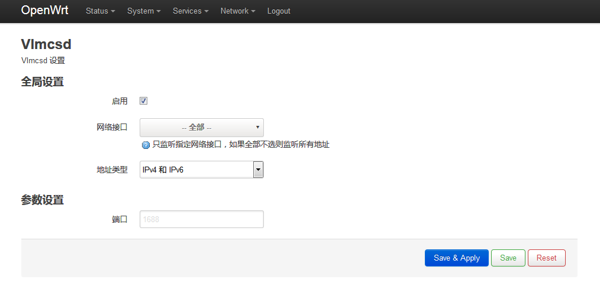

# luci-app-vlmcsd
- 支持`openwrt 18.06`及之后的版本  
需要配合 [openwrt-vlmcsd](https://github.com/flytosky-f/openwrt-vlmcsd) 使用
- 编译方法：  
进入 openwrt sdk 目录，执行：
```
git clone https://github.com/flytosky-f/luci-app-vlmcsd.git package/luci-app-vlmcsd
make menuconfig
make package/luci-app-vlmcsd/compile V=99
```
- 预览：

